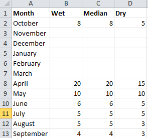
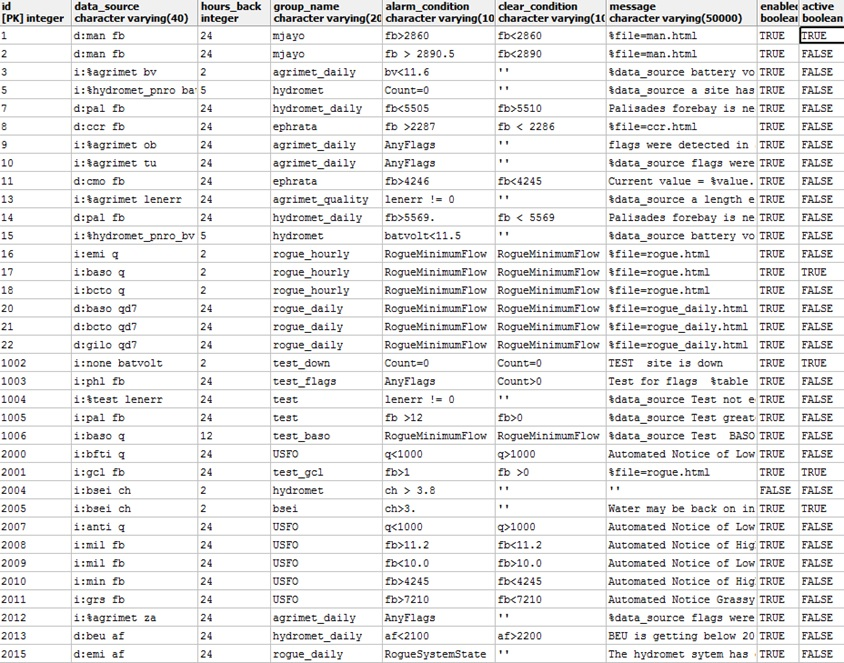

# Hydromet Notifications Software 

##Purpose

Hydromel Notifications software sends you an email or text message when water conditions reach the alert level.  Your input conditions are compared to the Hydromel System database.  An alert could be battery voltage is getting low at a Hydromet site, or when water level in a reservoir reaches a benchmark.   
There are also custom alerts for minimum flow requirements in the Rogue River.  See the section below (Rogue Minimum Flows Routine).
This system is a supplement to the near real-time Hydromet Alarms.  The Notification program runs on a separate computer from the mail Hydromet Server. 
Rogue Minimum Flows Routine

A special routine was prepared for minimum flows in the Rogue Basin.   This was funded with National Marine Fisheries Service (NMFS) BiOp implementation funding provided by the Yakima Area office.
The function named RogueMinimumFlow can be used in place of an alarm_condition or a clear_condition.  This can be used for daily or 15 minute data.   When RogueMinimumFlow  is in place the program logic performs the following steps.   
•	The data source becomes a filename.  For example the data source i:bcto q  becomes  bcto_q.csv.  bcto_q.csv contains the minimum flow requirements.

 
•	new rule: (April 2014) check for a file bcto_q.canal
o	 If file exists look inside that file for a canal.  (contents could be: talo qd)
o	If the canal is dry (< 5 cfs) then discontinue at this point because requirement does not apply. We are using daily canal values for this check.
•	The most recent daily value for the Rogue system contents (TALSYS/AF) is compared to the file talsys_afavg.csv to determine if the condition is Wet, Median, or Dry.  The file talsys_afavg.csv represents the average contents for each day in the water year.  If the contents are within +/-15,000 acre-feet of this average it is a Median condition.   If above average by 15,000 or more then Wet, if below average by 15,000  or more then Dry.
•	Lookup the appropriate minimum flow (by month and condition/state) and compare to Hydromet values.  Send email as needed. 

##Database Design

The Notification configuration is stored in the database tables:  alarm_definition, alarm_group, alarm_sites, and alarm_history. 
Alarm_definition describes conditions that require a notification, who to notify, and the status of the alarm.  
 

id is the primary key used by the database.

data_source - defines which hydrologic data and the database source.    The format is  database:site parameter.  For example the ‘d’ in “d:man fb” indicates daily Hydromet database.  ‘man’ is the Hydromet cbtt name for man creek reservoir.   ‘fb’ is the parameter for forebay.     Avanced data_source: The site definition can also reference a list of sites such as %agrimet in example 3 above.   Use the table alarm_sites to define a list of sites.  When using a list of sites like example wher id=3, the alarms the active column does not get set during an alarm.

hours_back - defines how many hours of data to query.  If you need two days of data enter 48. You usually want 2 hours for instant data, and 24 hours for daily data.

Group_name -  defines a set of alarms that will be processed together and a single  notification is sent to all email addresses defined in that group.  For example a group Hydromet_sites could be used to check all Hydromet sites for current data.    

alarm_condition - condition that will cause a notification to be sent.  The active column will set to ‘true’.  See the discussion below on conditions

clear_condition - condition that will cause a notification to be sent.  The active column will be set to ‘false’.  If the clear condition is not defined, the alarm needs to be cleared manually.  See the discussion below on conditions.
Message – this is the text for the email to be sent.   The following codes are used in the message to customize the email.
	%value – inserts the value from the data_source, used in evaluating the alarm_condition or clear_condition.
               %event_date  --- date that triggered this alarm notificationove.   This indicates when the alert condition occurred.
%event_date_yyyymmdd  --- event_date in a format like this:  20121231
	%table – inserts a table of values including hours_back hours of data
	%graph – inserts a graph (or link to one) showing the a few days of data
	%date – values checked in Hydromet for this date.

active - when true this indicates the alarm has been activated and a notification has been sent.   An activated alarm will not send new notifications until the clear_condition occurs.  

Conditions are brief mathematical expressions that describe what is an alarm (alarm_condition) and what can clear an alarm (clear_condition).  There are different ways to define an alarm condition:
1)	Limit condition  (Example :  > 1500 or <123.45  )
2)	Count condition (Example :   Count<4   or Count >1 or Count=0)
3)	AnyFlags keyword  ( looks at flags, not the actual numbers, for bad data)

Alarm_group describes groups of alarm sthat will be processed together, and the coresponding list of email addresses.
 

Alarm_sites defines a list of sites that will be processed together using the 
 

Alarm_history contains a log of notifications sent.
 
The alarms are

Case 3: Minimum flows are below a target. Send custom emails, different message for different email address.  The email includes a link to the data associated with the alarm.
Case 3a: Alarm for minimum flows that do not apply during winter (Nov-Mar).
Case 4: Monthly notification about current flow targets that are defined by a total reservoir storage.  If the target changes another notification would be sent.

##Limitations

Within a single group you can’t mix quality data with ‘regular’ data.  Instead create multiple groups.  For example checking for battery voltage (batvolt in Hydromet quality data) must be in a separate group from air temperature readings.

##Other Examples
Man creek  MAN FB – when above  2860 feet (reporting required twice a  month). When above 2890.5 (reporting daily is required).   
	Check for negative PP once a day
	Check for length errors (Hydromet once an hour?  At least once a day)
	Check battery voltage.
alarmdefinition table defines the conditions that cause and clear alarms.   The message is defined with tags that are replaces when the alarm message is created.   <data=jck af, back=10> would return 10 days of data for Jackson lake from the database defined by the datasource column.
Alarmhistory contains a history of all alarms
A cron job processes a group of alarms and sends a single email.

##Example Email Format:
To:  <list of email addresses> see alarm_email_liset
From: <user and machine running command>
Subject: Hydromet Notification Report (agrimet)
Date: June 22, 2012 1:26 pm
Description	Graph	Data
Missing data for Boise Weather Station		http://www.usbr.gov/pn-bin/rtgraph.pl?sta=boii&parm=ob 
	http://www.usbr.gov/pn-bin/rtgraph.pl?sta=boii&parm=ob 

		

##Program Unit Testing

Unit Testing allows software to be automatically tested.  This improves confidence in making changes to software before deploying new code.  HydrometNotifications program has a file called TestCases.cs that contains several tests that verify the correct operation of the alerts.   There are corresponding entries in the database with the prefix test_ that are kept in place for this purpose.

